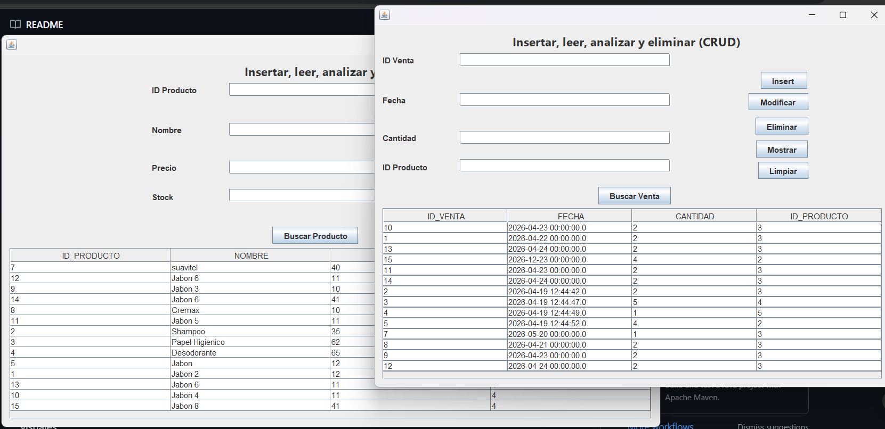
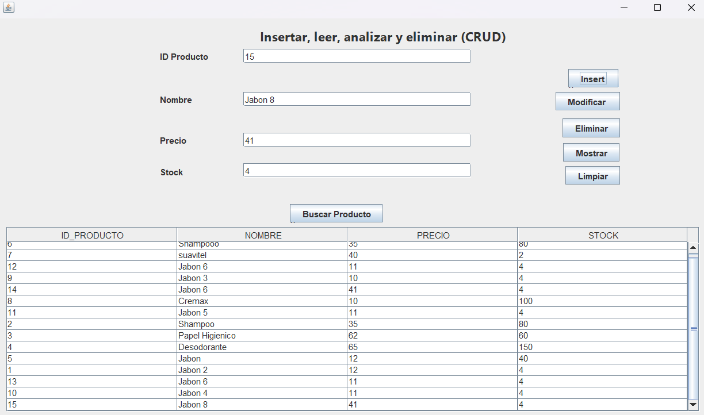
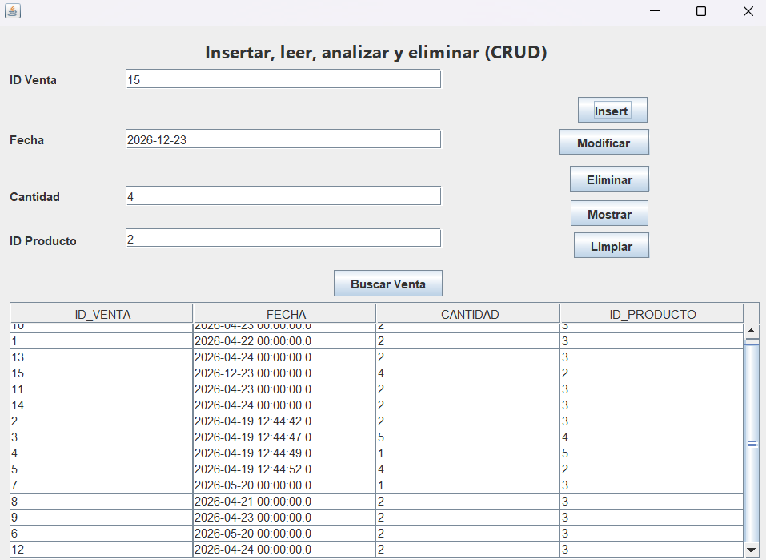

# Proyecto_Interfaz_Oracle_CRUD

Aplicación de escritorio en Java con interfaz gráfica para gestión completa de datos en Oracle 21c XE mediante operaciones CRUD.



---

## Tech Stack

- Java (JDK 17+)
- Oracle Database 21c XE
- JDBC — ojdbc11
- Apache NetBeans (Swing / JFrame)
- Maven

---

## Arquitectura

El proyecto aplica un modelo en capas para separar responsabilidades:

```
src/
├── LogicaCRUD/          # Punto de entrada (main)
├── GUICRUD/             # Capa de presentación (JFrame, eventos)
└── PersistenciaCRUD/    # Capa de acceso a datos (JDBC, ConexionDB)
```

Cada capa tiene una única responsabilidad. La GUI no conoce SQL y la capa de persistencia no conoce componentes visuales.

---

## Features

- **Create** — Inserción de registros con validación de campos vacíos
- **Read** — Consulta y visualización en JTable con carga dinámica via ResultSetMetaData
- **Update** — Modificación de registros existentes con búsqueda previa por ID
- **Delete** — Eliminación con diálogo de confirmación para prevenir borrados accidentales
- **Search** — Búsqueda de alumno por ID con retroalimentación visual
- CRUD extendido sobre tablas `productos` y `ventas` (esquema Tienda)

---

## Seguridad

Todas las operaciones usan `PreparedStatement` en lugar de concatenación de strings.

```java
// ❌ Vulnerable a SQL Injection
String sql = "SELECT * FROM alumno WHERE id_alumno = " + input;

// ✅ Implementación en este proyecto
String sql = "SELECT * FROM alumno WHERE id_alumno = ?";
PreparedStatement pst = conn.prepareStatement(sql);
pst.setString(1, input);
```

Esto evita que el input del usuario sea interpretado como instrucción SQL. Las credenciales de conexión se gestionan en un archivo de configuración externo, excluido del repositorio.

---

## Setup

### 1. Clonar el repositorio

```bash
git clone https://github.com/tu-usuario/Proyecto_Interfaz_Oracle_CRUD.git
```

### 2. Configurar credenciales

Copia el archivo de ejemplo y edítalo con tus datos:

```bash
cp config.example.properties config.properties
```

```properties
db.url=jdbc:oracle:thin:@//localhost:1521/XEPDB1
db.user=TU_USUARIO
db.password=TU_PASSWORD
```

### 3. Requisitos

- Oracle Database 21c XE corriendo en localhost:1521
- Esquema `BDDEMO1` con tabla `ALUMNO` creada
- Esquema `TIENDA` con tablas `PRODUCTOS` y `VENTAS`
- JDK 17 o superior

### 4. Ejecutar

Abrir en NetBeans → Clean and Build → Run

Maven descarga automáticamente la dependencia `ojdbc11-21.9.0.0`.

### 📸 Vistas de la Aplicación

**Gestión de Productos:**


**Gestión de Ventas:**


---

## Autor

**Angel** — ISC 4to Semestre, ITSC
